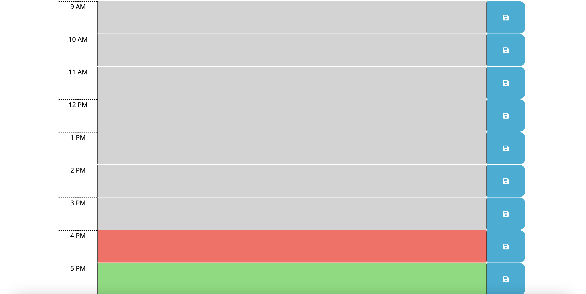

# WorkDaySchedule
This program was created in order to show a daily schedule that the user can use to type out what appointments/meetings/reminders for that day and save it using the save buttons on the right end of each row. The planner consists of 9 individual sections divided per hour from 9am to 5pm. These sections can be of 3 different colors:
1. **_Gray_ hour rows have already occurred.**
2. **_Red_ hour rows represent the current hour.**
3. **_Green_ hour rows represent the hours that are still to occur during the day.**

# Deployed Link
[WorkDaySchedule](https://jpls218.github.io/WorkDaySchedule/)
Below is a screenshot of the application once opened:

Below is a screenshot of the application that shows the different colored columns:

